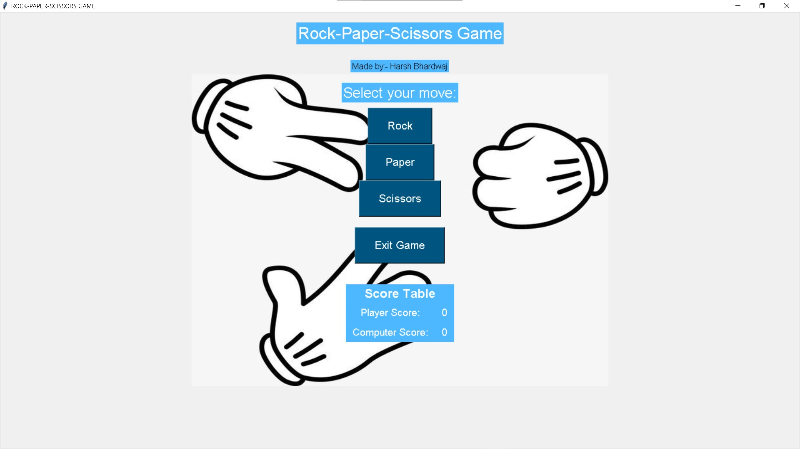
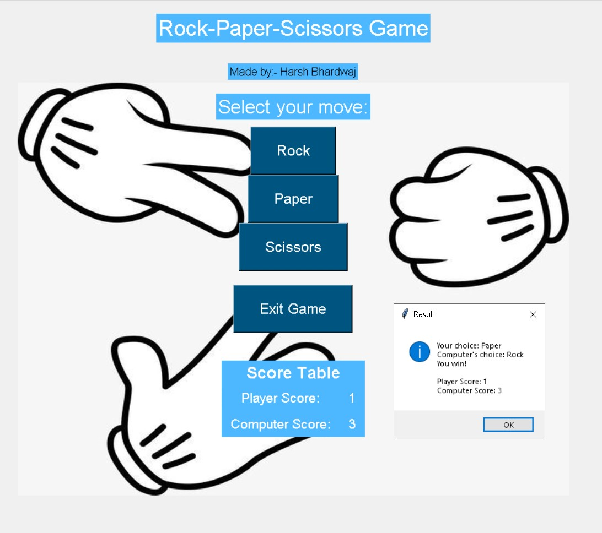

## Rock-Paper-Scissors Game 🎮

This is a simple Rock-Paper-Scissors game implemented using Python and the Tkinter library. The game allows players to make choices and keeps track of the scores. The game ends when either the player or the computer reaches a score of 5.


## Features 🎉

- **Gameplay: Players can choose from Rock, Paper, or Scissors.**
- **Scorekeeping: The game keeps track of the player's and computer's scores.**
- **Game Over: The game ends when either the player or the computer reaches a score of 5.**

## Screenshots

 

## How to Play 🎲

1. **Run the Program: Run the program using Python.**
2. **Select Your Move: Choose your move from the options: Rock, Paper, or Scissors.**
3. **Play the Game: The game will randomly select the computer's move and determine the winner.**
4. **Check the Score: The game will display the current scores.**
5. **Play Again: You can play again by selecting a new move.**

## Code Explanation 📝

The code is divided into several functions: 

1. `create_window`: Creates the main window of the game.
2. `create_widgets`: Creates the buttons and labels for the game.
3. `play_game`: Handles the game logic and updates the scores.
4. `update_score_table`: Updates the score table with the current scores.
5. `show_final_scores`: Displays the final scores and determines the winner.

## Installation

1. Clone the repository:
   
   ```bash
   git clone https://github.com/your-username/rock-paper-scissors.git

2. Navigate to the project directory:
   
   ```bash
   cd rock-paper-scissors

3. Install dependencies (ensure you have Python and pip installed):

   ```bash
   pip install -r requirements.txt

4. Run the game using Python:

   ```bash
   python rock_paper_scissors.py

## Credits

- Author: Harsh Bhardwaj
- Background Image: [Background image](background.jpg)
